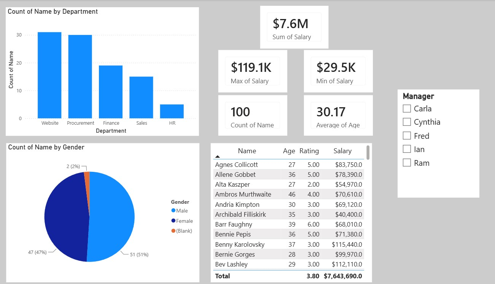

# HR Analytics Dashboard using Power BI

## Dashboard Preview

## Project Overview

An interactive HR Analytics dashboard built using Power BI to analyze employee data and provide insights into workforce trends, employee distribution, and key HR metrics.

## Tools Used

- Power BI
- Power Query
- DAX
- Data Modeling

## Key Features

- Employee demographics analysis
- Department-wise employee distribution
- Gender distribution
- Employee performance insights
- Interactive filtering and drill-down analysis

## Dashboard KPIs

- Total Employees
- Average Age
- Department Count
- Employee Distribution

## Skills Demonstrated

- Data Cleaning
- Data Transformation
- Data Modeling
- DAX Measures
- Dashboard Design
- Business Intelligence Reporting
